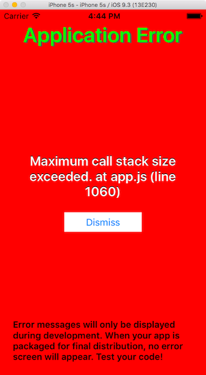

faster-titanium break case
==========================

Environment
-----------

* Node.js v4.4.0
* Titanium CLI 5.0.6
* Alloy 1.8.1
* Titanium SDK 5.2.0.GA


Reproduce
---------

```
$ ti build -p ios --faster
```

 


Supplement
----------

If modified as follows, the error does not occur.

*app/lib/hoge.js*

```javascript
//'use strict';     <== comment out

function hoge() {
}

exports.hoge = hoge;
```
